# OFDM Diffusion Denoiser

A research-oriented PyTorch project that compares classical OFDM receivers against a diffusion-based post-equalization denoiser.

This repository is designed to reproduce the core idea from **CDDM (Wu et al., IEEE TWC 2024)** in a clean and modular way:

- Build a reliable classical CP-OFDM baseline first.
- Measure BER/SER for LS/ZF, LS/MMSE, and Perfect-CSI/MMSE.
- Feed MMSE-equalized symbols into a DDPM-style denoiser.
- Evaluate whether diffusion denoising improves BER in low-to-mid SNR regimes.

## 1. Why This Project Exists

Classical OFDM receivers already do a lot of heavy lifting:

- OFDM diagonalizes frequency-selective multipath channels into per-subcarrier channels.
- Pilot-based channel estimation approximates channel response.
- Equalizers (ZF/MMSE) invert channel distortion.

After that pipeline, most channel impairment is gone, but **residual noise and estimation error remain**.

The key hypothesis of this project is:

> A diffusion model can learn a data-driven denoising prior over equalized constellation points and reduce residual errors that classical linear equalizers cannot fully suppress.

Important design philosophy:

- Diffusion is **not** replacing synchronization, FFT, channel estimation, or equalization.
- Diffusion is used as a **post-equalization denoiser**.
- We treat MMSE output as a noisy estimate of clean symbols and denoise toward valid 16-QAM points.

## 2. Problem Setup

### 2.1 Signal Chain

At a high level, one frame follows:

1. Random bits are mapped to 16-QAM symbols.
2. Symbols are arranged on OFDM subcarriers with pilot insertion.
3. IFFT + cyclic prefix (CP) creates time-domain waveform.
4. Multipath Rayleigh channel + AWGN corrupts waveform.
5. Receiver removes CP, applies FFT, and recovers frequency-domain subcarriers.
6. Channel is estimated from pilots (LS baseline).
7. Equalization is applied (ZF or MMSE).
8. Hard demapping returns bits for BER/SER.
9. Optional diffusion denoiser refines MMSE-equalized symbols before demapping.

Signal-chain sketch used in this repo:



How to read this diagram in implementation terms:

- Left-to-right blocks map directly to the execution flow in `src/classical_receiver.py`.
- OFDM waveform handling corresponds to `src/ofdm.py`.
- Channel and noise blocks correspond to `src/channel.py`.
- Estimation and equalization blocks correspond to `src/estimation.py` and `src/equalization.py`.
- The post-equalization ML refinement stage maps to `src/diffusion/` modules.

### 2.2 Scope (v1)

- Modulation: 16-QAM
- Waveform: CP-OFDM
- Channel: Rayleigh multipath with exponential PDP
- Baselines: LS+ZF, LS+MMSE, Perfect-CSI+MMSE
- ML model: DDPM-like denoiser on MMSE-equalized symbols
- Primary metric: BER vs SNR
- Secondary metrics: SER, constellation evolution, training/validation curves

## 3. Theory Primer (Practical, Not Formal)

### 3.1 Why OFDM Helps in Multipath Channels

Time-domain multipath causes inter-symbol interference and frequency-selective fading.
With a sufficiently long CP and FFT processing, each subcarrier approximately sees:

`y[k] = H[k] * x[k] + n[k]`

So the hard MIMO-like time-domain equalization problem is converted into many scalar per-subcarrier equalization problems.

### 3.2 Pilot-Aided LS Channel Estimation

On pilot tones:

`H_hat_LS[k_p] = Y[k_p] / X_pilot[k_p]`

This estimate is simple but noisy. For comb pilots, we interpolate from pilot positions to data subcarriers.

At pilot subcarriers, LS estimation error variance scales like:

`MSE ~ sigma_n^2 / |X_pilot|^2`

This is one of the first sanity checks for the classical baseline.

### 3.3 Equalization: ZF vs MMSE

- ZF roughly divides by `H_hat[k]` and can strongly amplify noise in deep fades.
- MMSE trades inversion accuracy against noise amplification using noise variance.

MMSE usually dominates ZF in practical SNR ranges, especially when channel estimates are imperfect.

### 3.4 Why Diffusion After MMSE

After MMSE, the symbol can be viewed as:

`x_hat[k] = x[k] + r[k]`

where `r[k]` is residual error (noise + estimation artifacts). This residual has structure that depends on SNR and channel conditions.

The diffusion model learns to remove this residual while preserving constellation geometry.

### 3.5 Warm-Start Reverse Diffusion

Standard DDPM sampling starts from pure Gaussian noise.
That is inefficient here because MMSE output is already close to clean symbols.

Instead:

1. Estimate post-MMSE residual variance from SNR.
2. Map variance to a diffusion timestep `t_start`.
3. Run reverse process from `t_start` down to 0.

This is the communication-aware diffusion trick that makes the approach practical.

## 4. Repository Design (Planned Modules)

```
ofdm-diffusion-denoiser/
├── README.md
├── requirements.txt
├── config/
│   └── default.yaml
├── src/
│   ├── ofdm.py
│   ├── channel.py
│   ├── estimation.py
│   ├── equalization.py
│   ├── demapper.py
│   ├── classical_receiver.py
│   ├── dataset.py
│   ├── metrics.py
│   └── diffusion/
│       ├── noise_schedule.py
│       ├── model.py
│       └── ddpm.py
├── scripts/
│   ├── train.py
│   ├── evaluate.py
│   └── plot_results.py
└── results/
```

### 4.1 Module Responsibilities

- `ofdm.py`: Resource mapping, pilot insertion, IFFT/FFT, CP add/remove.
- `channel.py`: Rayleigh multipath generation and AWGN injection.
- `estimation.py`: LS channel estimation and interpolation over subcarriers.
- `equalization.py`: ZF/MMSE equalization operators.
- `demapper.py`: Hard decision 16-QAM demapping and bit reconstruction.
- `classical_receiver.py`: End-to-end orchestration for baselines.
- `dataset.py`: Generates `(equalized_symbol, clean_symbol, snr_db)` training pairs.
- `metrics.py`: BER/SER computations.
- `diffusion/noise_schedule.py`: Beta schedule and alpha-bar values.
- `diffusion/model.py`: Residual MLP denoiser with time + SNR conditioning.
- `diffusion/ddpm.py`: Forward diffusion, loss target generation, reverse sampling.
- `scripts/train.py`: Training loop, checkpointing, logging.
- `scripts/evaluate.py`: BER/SER sweep over SNR for all methods.
- `scripts/plot_results.py`: BER and constellation figures.

## 5. Data Representation and Tensor Conventions

PyTorch supports complex tensors, but many deep models are easier and more portable in real channels.

Project convention:

- Complex symbol `z` is represented as two channels `[Re(z), Im(z)]`.
- Utility helpers convert between complex and two-channel real tensors.

Typical shape examples:

- Per symbol: `(2,)`
- Batch of symbols: `(B, 2)`
- OFDM grid flattened for training: `(B_total, 2)`

This convention is used consistently from dataset generation to diffusion training/inference.

## 6. Classical Baseline: Validation Logic

The classical pipeline must be trusted before introducing ML.

Required checks:

1. OFDM AWGN sanity:
At high SNR with AWGN-only channel, BER should approach zero.

2. LS estimator sanity:
Observed estimation MSE should track pilot-noise scaling behavior.

3. Baseline ordering:
Across SNR, LS+MMSE should generally outperform LS+ZF.

4. Genie bound:
Perfect-CSI+MMSE should be the strongest classical baseline.

If these checks fail, diffusion results are not meaningful.

## 7. Diffusion Model Design

### 7.1 Why Residual MLP Instead of U-Net

Input per sample is only a 2D symbol (`Re`, `Im`) plus condition information.
A large U-Net is unnecessary overhead.

Chosen architecture:

- Residual MLP
- 4-6 residual blocks
- hidden dimension around 256
- sinusoidal timestep embedding
- SNR FiLM conditioning
- output predicts `epsilon` in two channels

Model sketch used in this repo:



How this diagram maps to code:

- Time embedding and conditioning flow map to `src/diffusion/model.py`.
- Diffusion forward/reverse equations map to `src/diffusion/ddpm.py`.
- Beta/alpha schedule handling maps to `src/diffusion/noise_schedule.py`.
- The model consumes `[Re, Im]` plus conditioning and predicts noise in the same 2D real space.

### 7.2 Conditioning Strategy

Denoising strength depends on SNR; low-SNR samples need stronger denoising.

So the model is explicitly conditioned on:

- Diffusion timestep `t`
- Channel/SNR context (`snr_db` or equivalent normalized representation)

Without SNR conditioning, one model often under-denoises at low SNR or over-denoises at high SNR.

### 7.3 Training Objective

For each clean symbol sample:

1. Sample random diffusion step `t`.
2. Add Gaussian noise according to schedule.
3. Predict added noise `epsilon_hat`.
4. Minimize MSE between true and predicted noise.

## 8. Evaluation Methodology

For each SNR in evaluation range (e.g. -5 to 30 dB):

1. Generate many OFDM frames.
2. Compute BER/SER for LS+ZF, LS+MMSE, PerfectCSI+MMSE.
3. Run MMSE symbols through diffusion denoiser and demap.
4. Compute BER/SER for diffusion-enhanced receiver.
5. Write results to CSV.
6. Plot semilog BER curves and constellation snapshots.

Constellation snapshots should include at least:

- Transmitted symbols
- Post-channel (frequency-domain observation)
- Post-MMSE
- Post-diffusion

for low/mid/high SNR examples.

## 9. Configuration and Reproducibility

The full experiment is controlled via `config/default.yaml`.

It should include:

- OFDM parameters: subcarriers, CP, pilot pattern
- Modulation order
- Channel configuration
- Training hyperparameters
- Diffusion schedule/model settings
- Seed and device settings

Reproducibility checklist:

- Set Python, NumPy, and PyTorch seeds.
- Use deterministic backend settings where practical.
- Log exact config values used for each run.

## 10. Expected Outputs and Success Criteria

### 10.1 Artifacts

`results/` should contain:

- Training curves/logs
- Best checkpoint
- BER/SER CSV tables
- BER vs SNR plots (PNG/PDF)
- Constellation plots (PNG/PDF)

### 10.2 Success Criteria

- Classical baselines are stable and physically plausible.
- BER curves reflect expected ordering of methods.
- Diffusion denoiser shows measurable BER gain over MMSE in low-to-mid SNR.
- Scripts execute end-to-end without manual edits:

`python scripts/evaluate.py && python scripts/plot_results.py`

## 11. Development Workflow

This project follows milestone-based development:

1. Classical receiver baseline
2. Dataset generation
3. Diffusion core
4. Training pipeline
5. Evaluation and plots

Engineering rules:

- Commit after each milestone and after major coherent sub-steps.
- Run relevant checks before each commit.
- Keep modules small and testable.
- Prefer explicit interfaces and reproducible experiments over hidden magic.

## 12. Current Status

This repository now includes an active implementation baseline, and this README is maintained as a living companion to each milestone.

Implemented so far:

- `requirements.txt` with core dependencies (`torch`, `numpy`, `matplotlib`, `PyYAML`, `tqdm`, `pytest`)
- `config/default.yaml` as the single source of experiment configuration
- Phase 1 core modules for OFDM, channel simulation, LS estimation, ZF/MMSE equalization, demapping, and classical receiver orchestration
- Phase 2 dataset generation module for `(equalized_symbol, clean_symbol, snr_db)` pairs
- Phase 3 diffusion core modules (noise schedule, residual MLP denoiser, DDPM process)
- Scripts scaffolded for training, evaluation, and plotting
- Unit tests for classical baseline, dataset generation, and diffusion shape/schedule sanity

Living-document rule:

- Every major implementation step is explained here in terms of both theory and code logic.
- Changes to `requirements.txt` and `config/default.yaml` are documented here whenever they affect reproducibility or behavior.

## 13. References

- Wu et al., CDDM-style communication denoising concept (IEEE TWC 2024 context)
- Standard OFDM references for CP-OFDM and pilot-aided channel estimation
- DDPM literature for diffusion training and reverse sampling

(Exact citation details can be expanded once the final report or blog-post-ready version is prepared.)
